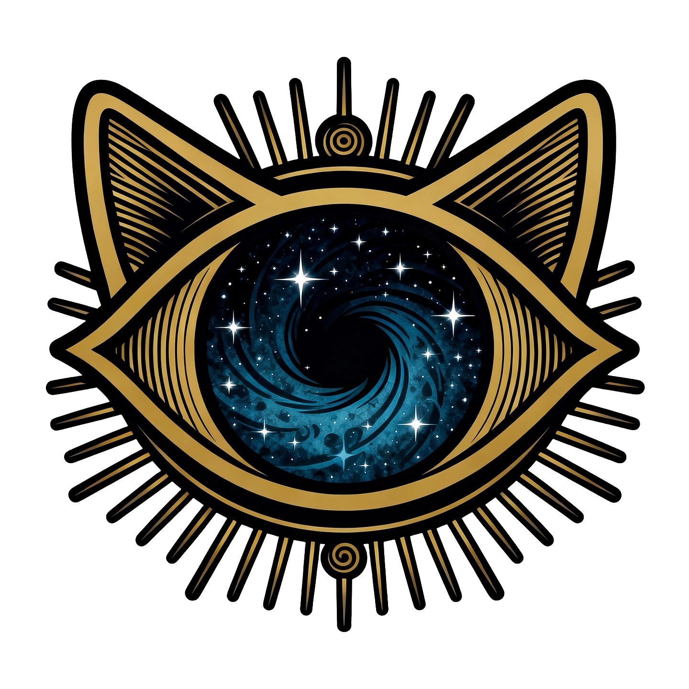

# 🌌 NINE LIVES AUDIO 🐱‍👤

## *"Because your audiobooks deserve NINE chances to blow your mind"*



---

### ⚡ WHAT IN THE COSMIC HELL IS THIS?

Nine Lives Audio is an **Android audiobook player** so premium, so elegant, so *cosmically gorgeous* that your other apps will file for unemployment. Built with Kotlin + Jetpack Compose, this app doesn't just play audiobooks—it **TRANSCENDS THEM INTO THE VOID**.

Designed for [Audiobookshelf](https://www.audiobookshelf.org/) servers, Nine Lives Audio lets you track up to **NINE simultaneous audiobooks** (because who even finishes one book anymore?) with a mystical "life" system that makes your reading history look like an ancient prophecy.

---

## 🔥 FEATURES THAT WILL MELT YOUR FACE OFF

### 🎨 **THE COSMIC AESTHETIC**
- **Dark Void Theme**: #070A10 background so deep, light fears it
- **Gold Accents**: SigilGold (#C9A24A) that shimmers like ancient treasure
- **Nebula Gradients**: Radial violet-blue gradient that whispers "you're in space now"
- **Premium Cards**: 16.dp rounded corners with subtle strokes—*chef's kiss*
- **Glow Effects**: Restrained at 0.25 alpha because we're REFINED, not a rave
- **Custom Progress Rings**: Canvas-drawn circular indicators with:
  - Inner shadows for recessed depth
  - End cap dots with subtle glow
  - Sweep gradients that animate at 800ms
  - Starting at TOP (12 o'clock) like civilized humans

### 🏠 **THE NINE LIVES SYSTEM**
Your audiobook journey gets **MYTHICAL**:
- **9 Active Lives**: Track up to 9 books simultaneously in a cosmic energy gradient (Indigo → Violet → Pink → Orange → Amber)
- **Life Labels**: "FIRST LIFE", "SECOND LIFE", etc. with cosmic energy colors
- **Weight Badges**: HEAVY, MEDIUM, LIGHT (for books that hit different)
- **Progress Rings**: See exactly how much of each life you've consumed
- **Last Played**: Timestamps so you remember which reality you were in

### 📚 **LIBRARY THAT GOES HARD**
- **2-Column Grid**: Beautiful cards with cover art
- **Search**: Find your books before the void consumes them
- **View Modes**: All / Series / Authors / Genres
- **Filters**: Drill down by series, author, or genre
- **Download Badges**: Cloud icons for offline books
- **Pull-to-Refresh**: Syncs with your Audiobookshelf server
- **Progress Bars**: Thin gold lines showing completion (2.dp height, AccentGold)

### 🎵 **PLAYBACK THAT SLAPS**
- **Background Audio**: Media3 ExoPlayer with foreground service
- **Sleep Timer**: Fall asleep to cosmic wisdom
- **Playback Speed**: 0.5x to 3.0x (for the speed readers)
- **Chapter Navigation**: Jump between chapters
- **Progress Sync**: Auto-syncs with Audiobookshelf server
- **Mini Player**: Persistent bottom bar with play/pause
- **Lock Screen Controls**: Because you're fancy

### 🚀 **LEFT NAV RAIL** (Desktop-Style Navigation)
- **72.dp Wide**: Vertical navigation that means business
- **Gold Indicator**: 3.dp vertical bar with 0.25 alpha glow
- **Pill Background**: Semi-transparent gold (12% alpha) on selected items
- **5 Tabs**: Home, Library, Player, Downloads, Settings
- **Material Icons**: Filled when selected, outlined when not

### 📥 **DOWNLOADS**
- **Offline Playback**: Download entire books
- **Progress Tracking**: Watch your books download in real-time
- **Queue Management**: Cancel, pause, resume
- **Storage Stats**: See how much space your cosmic knowledge consumes

### ⚙️ **SETTINGS FOR POWER USERS**
- **Server Configuration**: Connect to your Audiobookshelf instance
- **Auth Support**: Token-based authentication
- **Self-Signed Certs**: We trust YOUR server
- **Theme Options**: (Currently cosmic dark only, more coming)
- **Playback Defaults**: Set your preferred speed, sleep timer, etc.

---

## 🛠️ TECH STACK THAT MAKES DEVS CRY (WITH JOY)

### **Architecture**
- **MVVM**: Clean separation with ViewModels
- **Hilt/Dagger**: Dependency injection that just works
- **Kotlin Coroutines**: Async operations smoother than butter
- **Flow**: Reactive state management
- **Room**: Local SQLite database for offline glory

### **UI Framework**
- **Jetpack Compose**: 100% Compose, zero XML
- **Material 3**: Customized to cosmic perfection
- **Canvas API**: Custom progress rings drawn from scratch
- **Coil**: Image loading with AsyncImage
- **Navigation Compose**: Type-safe routing

### **Media Playback**
- **Media3 ExoPlayer**: Industry-standard audio player
- **MediaSession**: Lock screen + Android Auto support
- **Foreground Service**: Keeps playing when screen is off

### **Networking**
- **Retrofit**: REST API client
- **OkHttp**: HTTP client with interceptors
- **Kotlinx Serialization**: JSON parsing
- **Custom Trust Manager**: Self-signed cert support

### **Data Layer**
- **Repository Pattern**: Clean data abstraction
- **Entity Mappers**: DTO ↔ Domain model conversion
- **DAOs**: Type-safe database queries
- **SharedPreferences**: Settings persistence
- **SecureStorage**: Sensitive data encryption

---

## 🎯 ROADMAP (AKA "WHAT'S NEXT IN THE COSMIC JOURNEY")

- [ ] **Bookmarks**: Mark your favorite moments
- [ ] **Notes**: Annotate the wisdom
- [ ] **Android Auto**: Navigate the cosmos from your car
- [ ] **Widgets**: Home screen widgets that glow
- [ ] **Tablet Layout**: Dual-pane for the large-screen elite
- [ ] **Custom Themes**: Let users choose their void
- [ ] **Statistics**: See your listening stats in cosmic charts
- [ ] **Social Features**: Share your Nine Lives with friends

---

## 🚀 GETTING STARTED

### **Prerequisites**
- Android Studio Ladybug | 2024.2.1 or later
- JDK 21 (OpenJDK recommended)
- Android SDK 35
- Kotlin 2.1.0
- An Audiobookshelf server (or get ready to set one up)

### **Build Instructions**
```bash
# Clone the cosmic repository
git clone https://github.com/StaticHumStudio/NineLivesKotlin.git
cd NineLivesKotlin

# Set JAVA_HOME (adjust path for your system)
export JAVA_HOME="/path/to/jdk-21"

# Build the APK
./gradlew assembleDebug

# Install on device
./gradlew installDebug
```

### **Connect to Your Server**
1. Open Nine Lives Audio
2. Navigate to Settings
3. Enter your Audiobookshelf server URL
4. Enter your username and password
5. Tap "Connect"
6. Watch the magic happen

---

## 🎨 DESIGN PHILOSOPHY

Nine Lives Audio follows a **Cosmic Premium Aesthetic**:
- **Dark**: Near-black space surfaces (#070A10)
- **Gold**: Refined accents (#C9A24A), not gaudy
- **Subtle**: Glow effects at 0.25 alpha max
- **Depth**: Inner shadows and elevation
- **Restrained**: No neon, no flashy animations
- **Elegant**: Every pixel has a purpose

Think **Interstellar** meets **luxury watch** meets **ancient grimoire**.

---

## 📱 SCREENSHOTS

*(Coming soon—once we get this baby running on a device)*

---

## 🤝 CONTRIBUTING

Want to add to the cosmic chaos? Here's how:

1. Fork the repo
2. Create a feature branch (`git checkout -b feature/cosmic-enhancement`)
3. Commit your changes (`git commit -m 'Add cosmic feature'`)
4. Push to the branch (`git push origin feature/cosmic-enhancement`)
5. Open a Pull Request
6. Wait for the cosmic review

### **Code Style**
- Follow Kotlin conventions
- Use meaningful variable names
- Comment complex logic
- Keep functions under 50 lines when possible
- Embrace Compose best practices

---

## 📜 LICENSE

MIT License - Because sharing knowledge is cosmic.

---

## 🙏 ACKNOWLEDGMENTS

- **Audiobookshelf**: For creating the best self-hosted audiobook server
- **Jetpack Compose Team**: For making UI dev not suck
- **Material Design**: For the foundation we built upon (and then made cosmic)
- **The Void**: For inspiring the aesthetic

---

## 🐛 KNOWN ISSUES

- PlayerScreen needs UI implementation (coming soon)
- DownloadsScreen needs UI polish (in progress)
- SettingsScreen needs full feature set (WIP)
- Sometimes the cosmic energy gets TOO powerful (rare)

---

## 💬 CONTACT

Built with ⚡ by **StaticHum Studio**

- GitHub: [@StaticHumStudio](https://github.com/StaticHumStudio)
- Issues: [GitHub Issues](https://github.com/StaticHumStudio/NineLivesKotlin/issues)

---

## ⚡ FINAL WORDS

This app was built by someone who believes audiobooks deserve better than bland, corporate UI. Nine Lives Audio is what happens when you combine:
- A love for audiobooks
- An obsession with beautiful design
- Too much caffeine
- The realization that life is too short for ugly apps

**Welcome to the void. Your nine lives await.** 🌌🐱‍👤

---

*"In the cosmic dance of bits and bytes, we found beauty. In the void between the stars, we built an app. In the space between audiobook players, we created... Nine Lives."*
